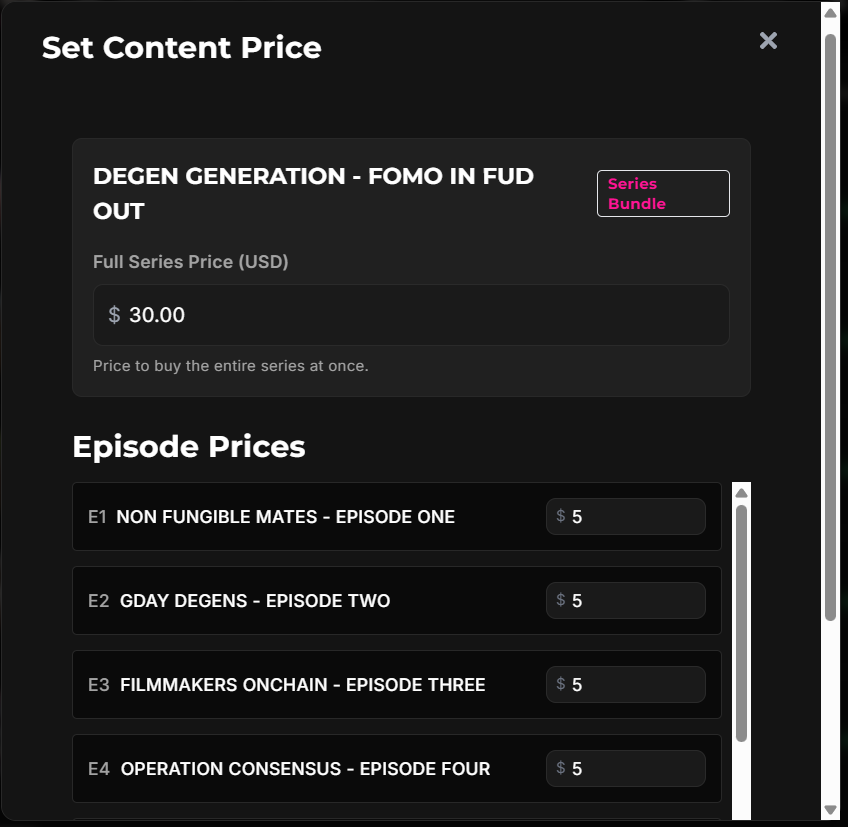
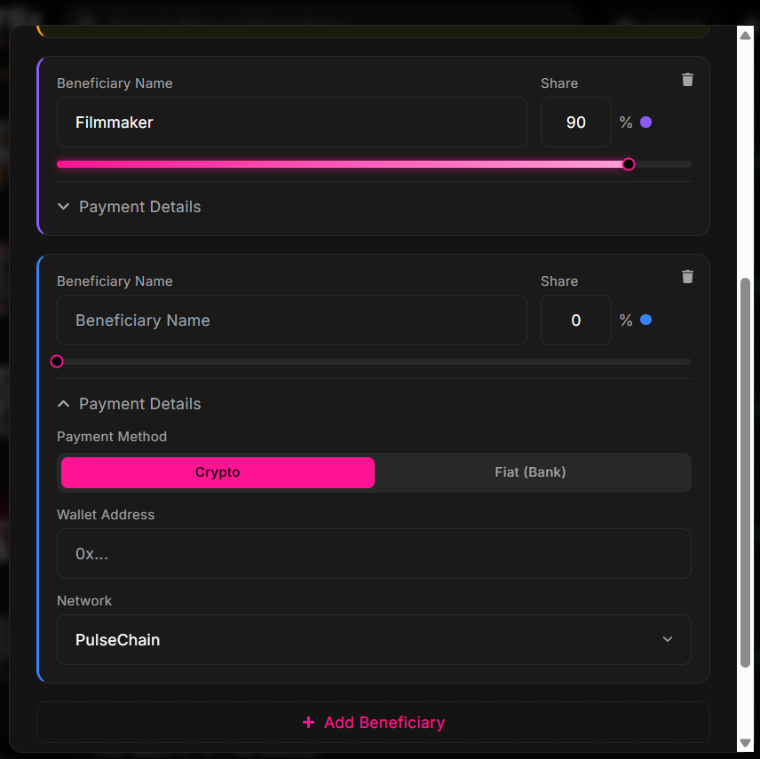
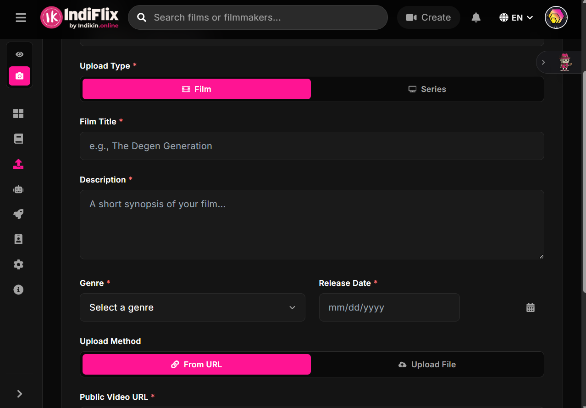
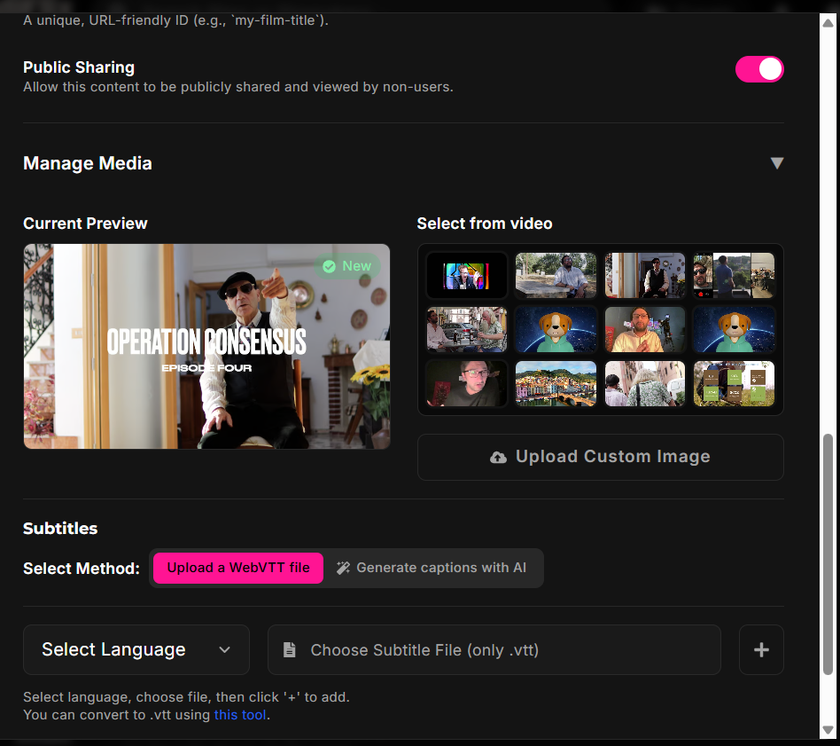
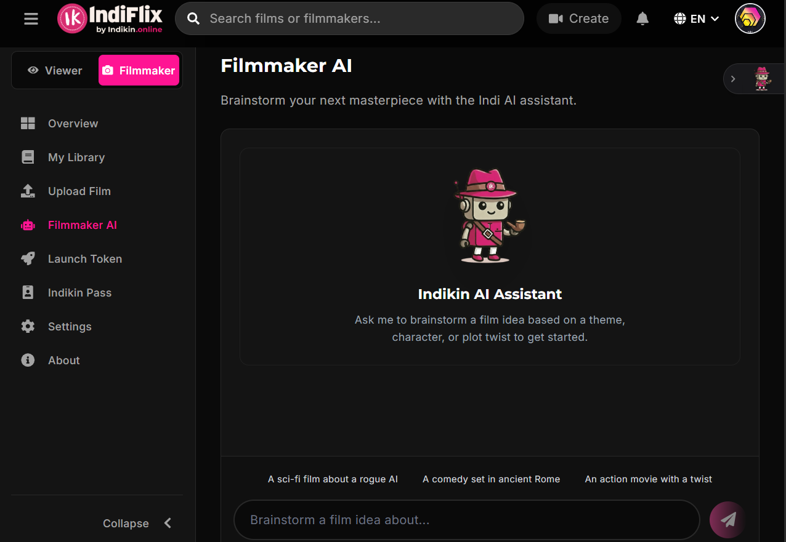
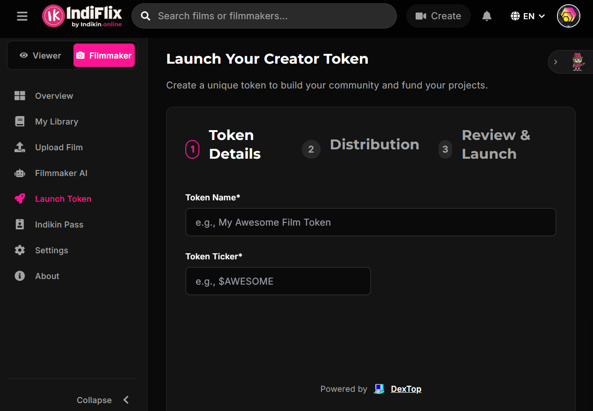

# Indikin Filmmaker Experience

This wing of the Indikin ecosystem showcases the tools and infrastructure designed to empower independent filmmakers. From creative brainstorming to decentralized funding, Indikin provides a vertically integrated stack for the modern creator.

## Creator Workflow Gallery

### 01. Content Management

The filmmaker dashboard provides a central hub for managing all media. High-fidelity status tracking ("Ready") ensures creators know exactly when their content is live and reachable.

### 02. Monetization Control

Filmmakers have granular control over their pricing strategy, allowing for direct-to-market sales without middleman interference.

### 03. Transparent Revenue Sharing

The "Beneficiaries" system allows for automated, on-chain splits. Creators can add collaborators and define percentage shares, ensuring trustless and immediate payouts.

### 04. Seamless Content Ingest

A streamlined interface for uploading films and series directly to the Indikin network, ready for global distribution.

### 05. AI-Powered Localization

Beyond metadata editing, Indikin integrates AI to **generate captions and subtitles** (WebVTT) automatically, breaking down language barriers for international audiences.

### 06. The Creative Partner: Indi AI

Indikin AI acts as a collaborative partner, assisting filmmakers with brainstorming themes (e.g., "A sci-fi film about a rogue AI"), plot twists, and character development.

### 07. Personalized Creator Economies

The ultimate tool for creative freedom: filmmakers can launch their own dedicated tokens to fund projects, reward loyal fans, and build a self-sustaining economy.

---
> [!TIP]
> For the underlying architecture of these filmmaker tools, refer to the [Technical Development domain](../../6-%20technical-development/README.md).
