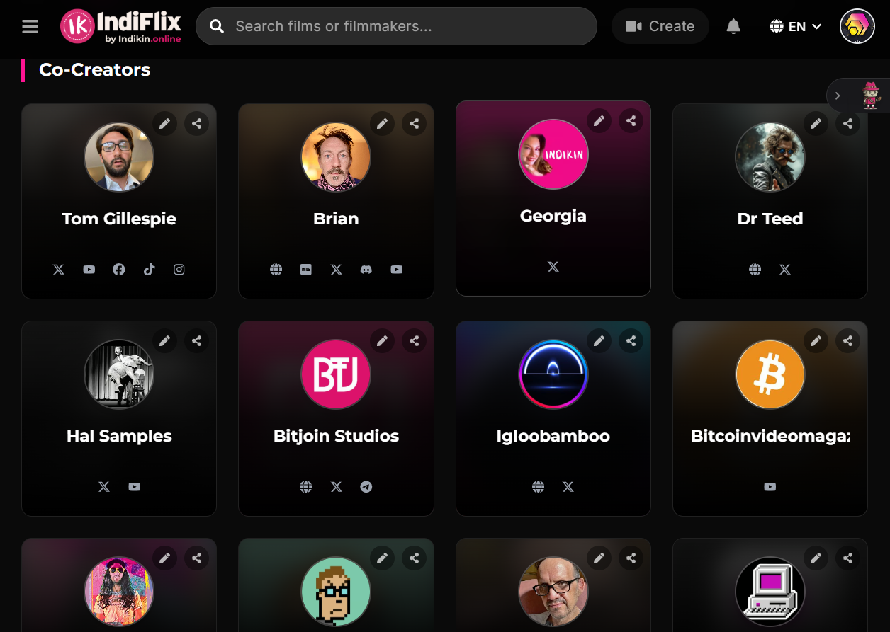
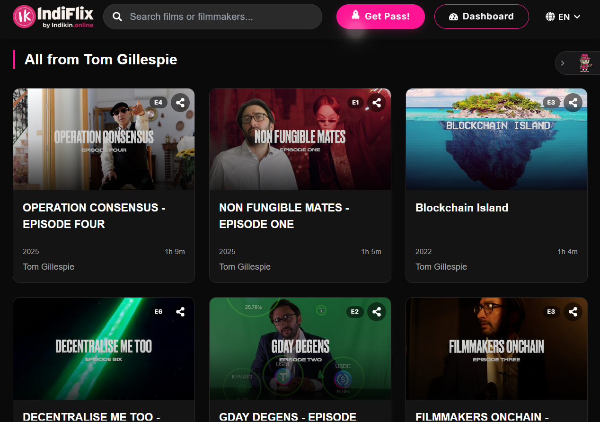
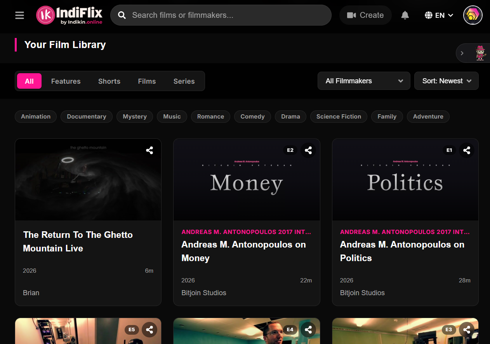
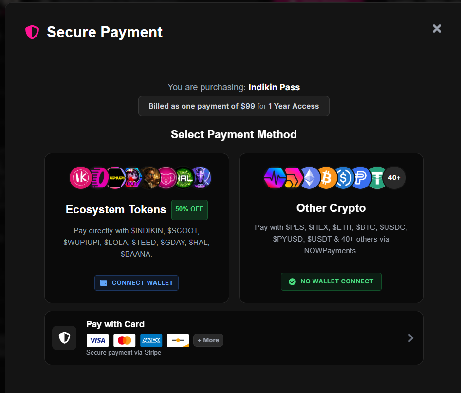
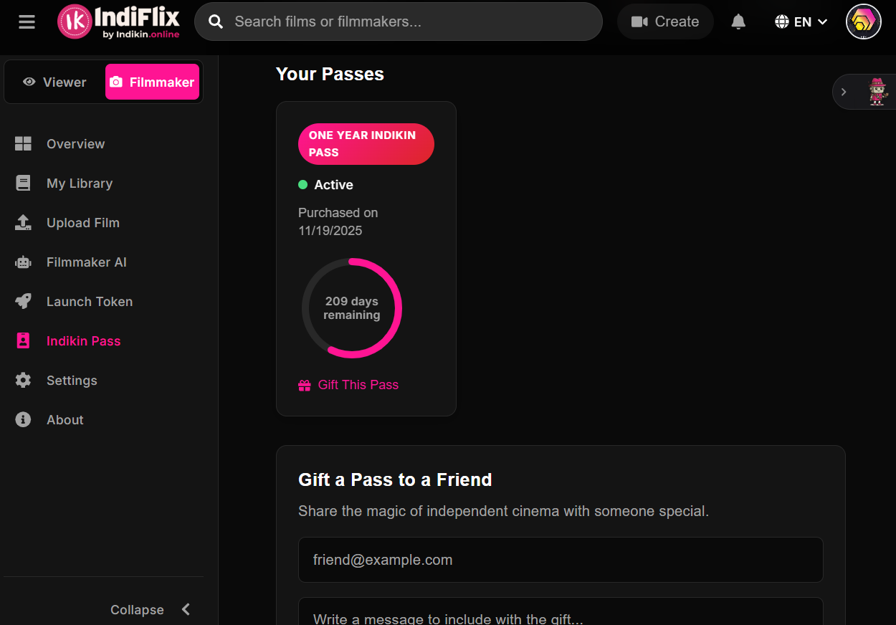

# Indikin Consumer Experience

Indikin redefines the relationship between the audience and the creator. This showcase details how viewers discover, support, and interact with the filmmakers they love in a decentralized environment.

## Audience Journey Gallery

### 01. Social Identity: The Co-Creator Profile

Every user in the Indikin ecosystem has a social-first profile that acts as a **Digital Business Card**. It integrates X, YouTube, TikTok, and other platforms to showcase the user's contributions and interests.

### 02. Creator Discovery

Public filmmaker profiles offer a direct window into the creator's vision, bio, and social reach, fostering a closer connection between the artist and the audience.

### 03. Transparent Catalogs

Audience members can browse complete filmographies and series catalogs directly from the filmmaker's public page.

### 04. Integrated viewing & Investment

Viewing pages are more than just players; they integrate real-time filmmaker token data ($GDAY example), allowing fans to support the creator's economy while they watch.

### 05. The Viewer Dashboard

A high-fidelity dashboard where users manage their personal library of purchased and accessible content.

### 06. Multi-Rail Payments

Indikin supports various payment methods to ensure accessibility:
- **Card**: Secure payments via Stripe.
- **Crypto**: Multi-token support via NOWPayments.
- **Ecosystem Tokens**: Direct wallet connection with a hardcoded **50% Discount**.

### 07. Progressive Loyalty: Membership Stages

A 5-stage loyalty system ($49 to $249) that rewards early adopters with unique benefits and long-term access to the ecosystem.

### 08. Community Gifting

Fans can grow the community by gifting passes to others, directly onboarding new members into the Film3 ecosystem.

---
> [!NOTE]
> All consumer interactions are designed for mobile and desktop responsiveness. For more on the platform's GTM strategy, see the [Go-To-Market domain](../../4-%20go-to-market/README.md).
