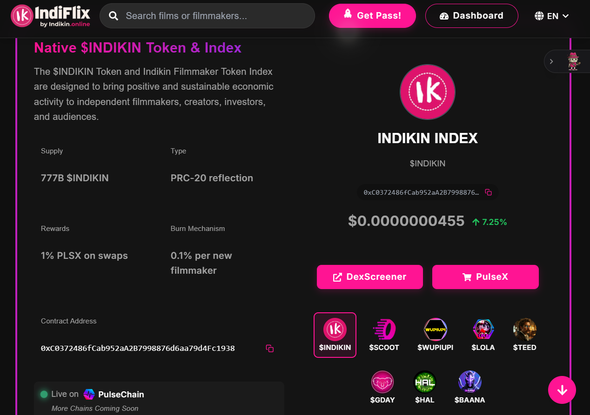

# Indikin Crypto Perspective: V1 Prototype vs. V2 Mainnet

The Indikin ecosystem is transitioning from a high-supply community prototype to an institutional-grade, yield-centric index. This perspective bridges the visual mechanics of the V1 deployment with the rigorous economic architecture of the V2 Ethereum migration.

## The Evolution of $INDIKIN

### V1 Prototype (PulseChain)

The initial deployment on PulseChain served as a proof-of-concept for the "Index" interface and the "Filmmaker Token" economy. 
- **Legacy Metrics**: 777 Billion supply, 1% PLSX reflections, and 0.1% burn-per-onboarding.
- **Utility Proof**: Demonstrated the **50% Discount** mechanic for ecosystem token holders.

### V2 Mainnet Roadmap (Ethereum)
The modernized Indikin economy (see [Business Development](../../2-%20business-development/INDIKIN_Tokenomics_Conservative.md)) is designed for institutional liquidity and sustainable yield.

- **Total Supply**: 10,000,000 $INDIKIN (Tight circulating supply of 1M).
- **Yield Mechanic**: Real, volume-backed yield distributed in **UNI** to circulating holders.
- **Tax Escalation**: Pre-committed annual tax increase (1% → 2% → 3%) to structurally improve holder APY.
- **Treasury Strategy**: 85% of supply is permanently locked and **excluded from rewards**, concentrating yield to active participants.

## The Utility Engine

While the V1 prototype featured a hardcoded 50% discount, the **V2 Mainnet** leverages the $INDIKIN token as the governance and yield entry-point for the **9 Million Token Production Fund**. 

- **Index exposure**: Holding $INDIKIN provides diversified exposure to the entire Film3 creator economy.
- **Governance**: Holders control the release of filmmaker grants from the Production Fund.

---
> [!IMPORTANT]
> The screenshots in this wing demonstrate the **User Interface (UI/UX)** functionality. For the current, binding financial specifications, always refer to the [Tokenomics Brief](../../2-%20business-development/INDIKIN_Tokenomics_Brief.md).
